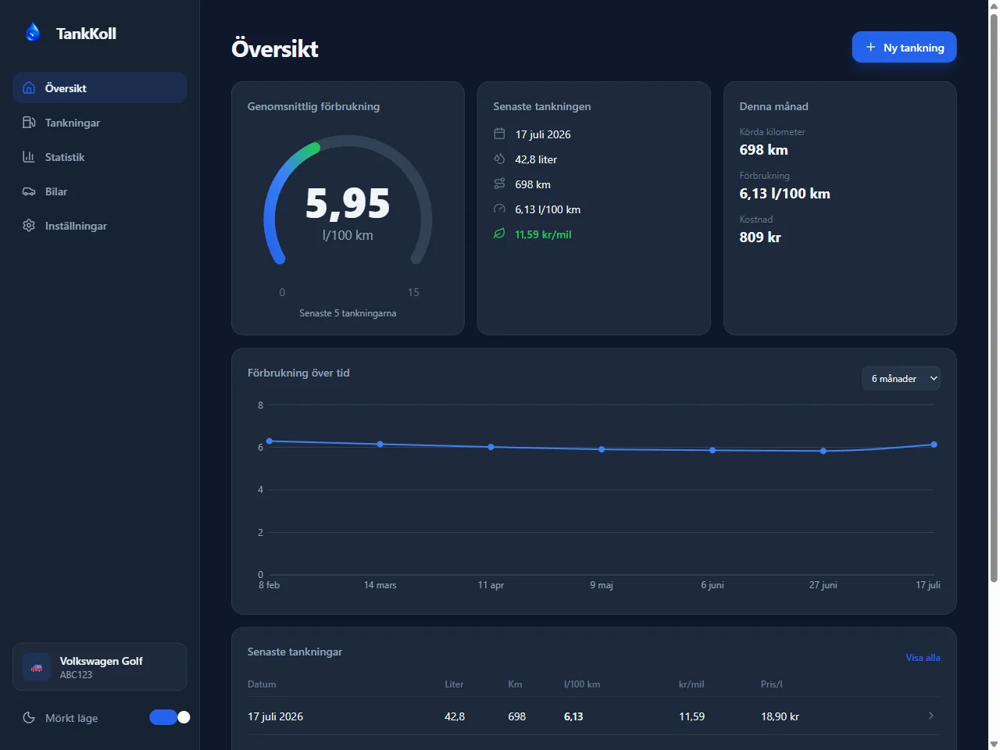
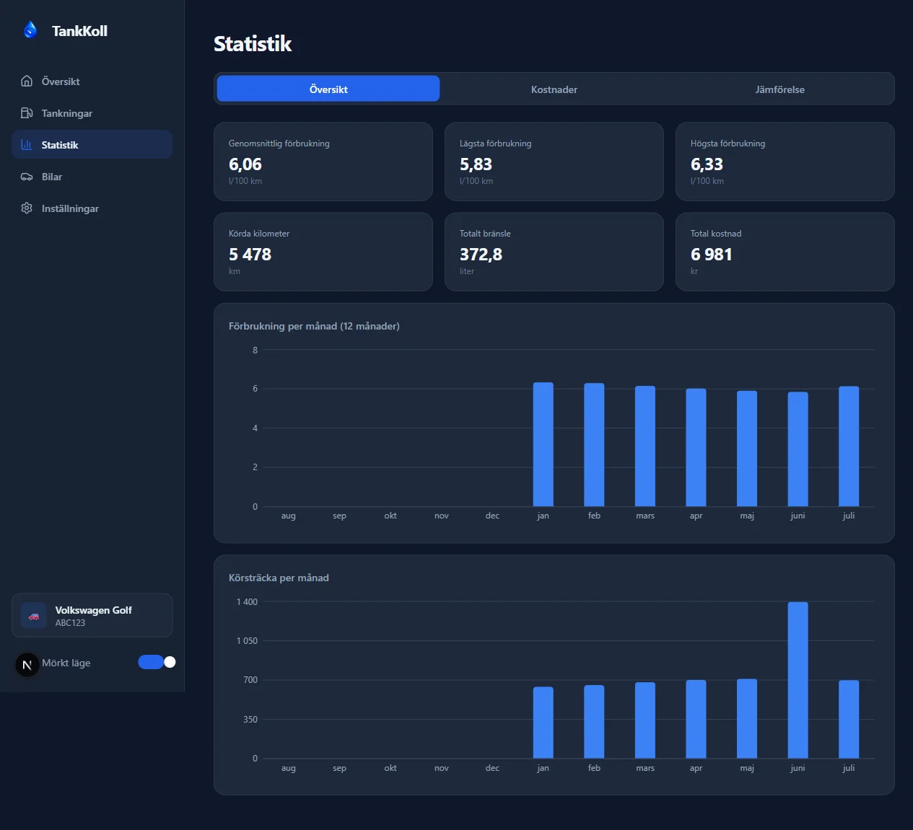
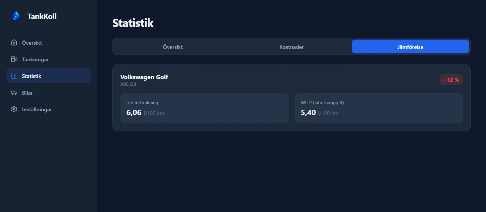
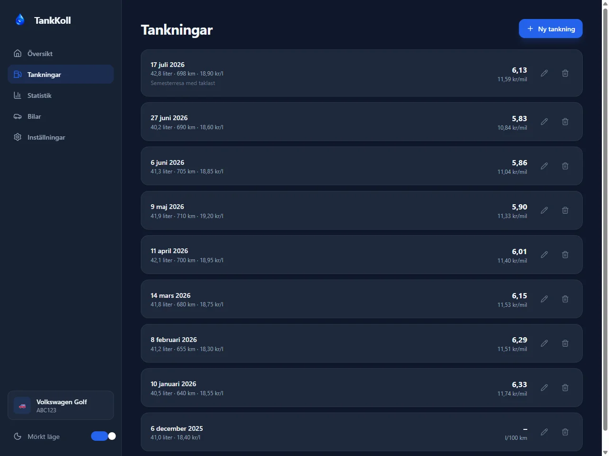
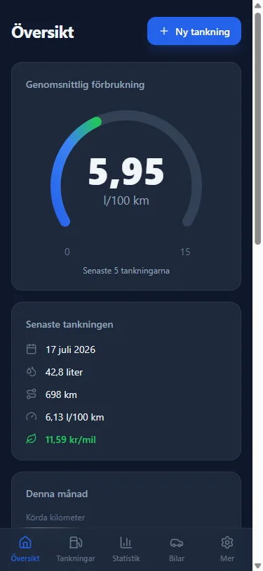
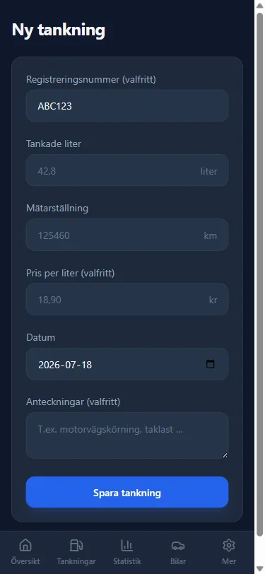

# TankKoll

**Håll koll på din bränsleförbrukning.** TankKoll är en gratis, installerbar
webbapp (PWA) som loggar dina tankningar, räknar ut bilens *verkliga* förbrukning
och jämför den mot fabriksuppgiften (WLTP). All data sparas lokalt i din
webbläsare – inga konton, ingen server, ingen spårning.

**Live:** https://everydayapps.se/app/tankkoll/


## Skärmbilder

| Översikt | Statistik |
| --- | --- |
|  |  |

| WLTP-jämförelse | Tankningshistorik |
| --- | --- |
|  |  |

| Mobil – Översikt | Mobil – Ny tankning |
| --- | --- |
|  |  |

## Funktioner

- **Översikt** – förbrukningsmätare (snitt av senaste 5 tankningarna),
  senaste tankningen, månadens körsträcka/förbrukning/kostnad,
  förbrukningsgraf med valbar period (3/6/12 mån) och de senaste tankningarna.
- **Ny tankning på under 15 sekunder** – liter, mätarställning, pris (valfritt),
  datum och anteckning. Körsträcka och förbrukning förhandsvisas live medan du
  skriver; en varning visas om mätarställningen är lägre än förra tankningens.
- **Historik** – alla tankningar med körsträcka, förbrukning, pris och kr/mil.
  Redigera eller ta bort (med bekräftelse) när som helst; allt räknas om direkt.
- **Statistik** i tre flikar:
  - *Översikt*: snitt/lägsta/högsta förbrukning, körda km, total bränslemängd
    och kostnad + månadsgrafer för förbrukning och körsträcka.
  - *Kostnader*: snittpris per liter, kostnad per mil/km, bränslekostnad per
    månad och prisutveckling över tid.
  - *Jämförelse*: din förbrukning mot bilens WLTP-uppgift, med grön badge under
    fabriksuppgiften och röd över (t.ex. **+11 %**).
- **Flera bilar** – namn, regnr, drivmedel, årsmodell, tankvolym, WLTP och
  valfri bild per bil. Växla aktiv bil; all statistik följer valet. Tas en bil
  bort försvinner även dess tankningar (efter dubbel bekräftelse).
- **Inställningar** – valuta (SEK/EUR/NOK/DKK), mörkt/ljust tema, export till
  JSON (fullständig backup) och CSV (semikolonseparerad för svensk Excel),
  import med validering samt total återställning.
- **PWA** – installerbar på mobil och dator, fungerar helt offline efter första
  besöket (service worker med network-first-navigering och cachade statiska
  resurser).

## Beräkningar

Härledda värden lagras aldrig – allt räknas ut ur den råa tankningslistan
(`src/lib/calculations.ts`, 45 enhetstester):

| Värde | Formel |
| --- | --- |
| Körsträcka | mätarställning − föregående tankning (sorterat på mätarställning) |
| Förbrukning | liter ÷ körsträcka × 100 (l/100 km) samt km/l |
| Kostnad | liter × pris/liter; kr/km och kr/mil |
| Snittförbrukning | **distansviktad**: Σ liter ÷ Σ km × 100 (inte medel av per-tankning) |
| Snittpris | literviktat medel av angivna priser |
| WLTP-skillnad | (verklig − officiell) ÷ officiell × 100, avrundat |

Regler: första tankningen per bil är baslinje (ingen förbrukning), tankningar
utan pris exkluderas ur kostnadsaggregat (räknas inte som 0 kr), och
månadsgrafer nollfylls över hela perioden. Mockupens siffror används som
testfacit: 42,8 l på 698 km ⇒ 6,13 l/100 km; 18,90 kr/l ⇒ 11,59 kr/mil.

## Teknik

Next.js 16 (App Router, statisk export) · React 19 · TypeScript · Tailwind v4 ·
Recharts · zustand · vitest · sharp

```
src/
  app/            # Tunna serverwrappers med metadata per rutt + manifest
  views/          # Klientvyerna (Översikt, Tankningar, Statistik, Bilar, Inställningar)
  components/     # Återanvändbara komponenter (Gauge, charts/, ConfirmDialog, …)
  lib/
    calculations.ts   # Rena, enhetstestade beräkningar
    storage/          # StorageAdapter-interface + LocalStorageAdapter
    vehicle-info/     # VehicleInfoProvider-interface + ManualVehicleProvider
    export.ts         # JSON/CSV-export och importvalidering
  store/          # zustand-store; enda stället som rör StorageAdapter
```

**Förberett för framtiden utan refaktorering:**

- `StorageAdapter` – LocalStorage i dag; ett REST-API implementerar samma
  interface och byts in via singletonen i `src/store/useAppStore.ts`.
- `VehicleInfoProvider` – bilformuläret anropar redan `lookup(regnr)` vid blur;
  ett riktigt registreringsnummer-API kopplas in i
  `src/lib/vehicle-info/ManualVehicleProvider.ts`.

## Utveckling

```bash
npm install
npm run dev              # dev-server
npm test                 # 45 enhetstester (beräkningar, lagring, export, store)
npm run typecheck        # tsc --noEmit
npm run build            # statisk export till out/ (+ RSC-utplattning postbuild)
npm run images:optimize  # regenerera public/-bilder från assets/generated/
```

Obs: `typescript` är medvetet pinnad till `^5` – TypeScript 7 (native)
saknar compiler-API:t som Next behöver och kraschar bygget.

## Grafik

Originalbilder genereras med AI (OpenAI Image API via MCP) till
`assets/generated/` – versionshanterade masterfiler, generera inte om i onödan.
`scripts/optimize-images.mjs` skapar webp-bilder, PWA-ikoner (inkl. maskable),
favicon och OG-bilden (bakgrund + textkomposition med sharp) i `public/`.

## SEO & tillgänglighet

Semantisk HTML med landmärken och skip-länk, ARIA-etiketter på mätare/grafer/
ikonknappar, synliga fokusringar, `prefers-reduced-motion`-stöd. Per-rutt-metadata,
Open Graph/Twitter-kort med absoluta URL:er, JSON-LD (`WebApplication`),
`sitemap.xml` och `robots.txt`.

## Deploy

Statisk export (`next build`, `output: "export"`) byggs i en Docker-container
och serveras av nginx bakom `everydayapps.se/app/tankkoll/`.
`NEXT_PUBLIC_BASE_PATH=/app/tankkoll` sätts som build-arg och styr
`next.config.ts`, `asset()`-helpern och `src/lib/site.ts` (canonical/OG/
sitemap) från samma källa. RSC-payloaderna plattas ut efter bygget
(`scripts/flatten-rsc-payloads.mjs`), och `manifest.ts`/`sitemap.ts`/
`robots.ts` använder `force-static` för att fungera i en statisk export.

## Licens

Byggd av [erlandsson.online](https://erlandsson.online). Data lämnar aldrig din
webbläsare – exportera till JSON för egen säkerhetskopia.
